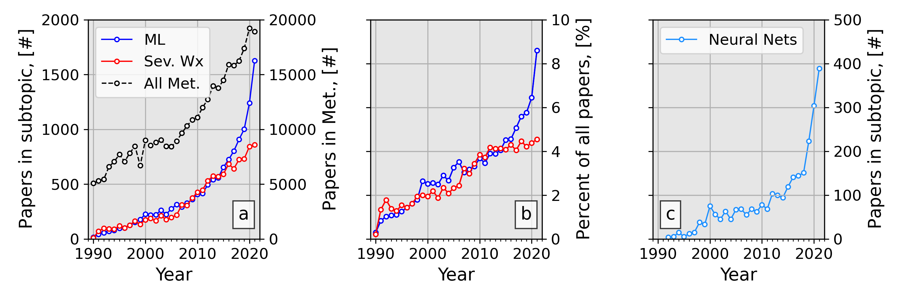
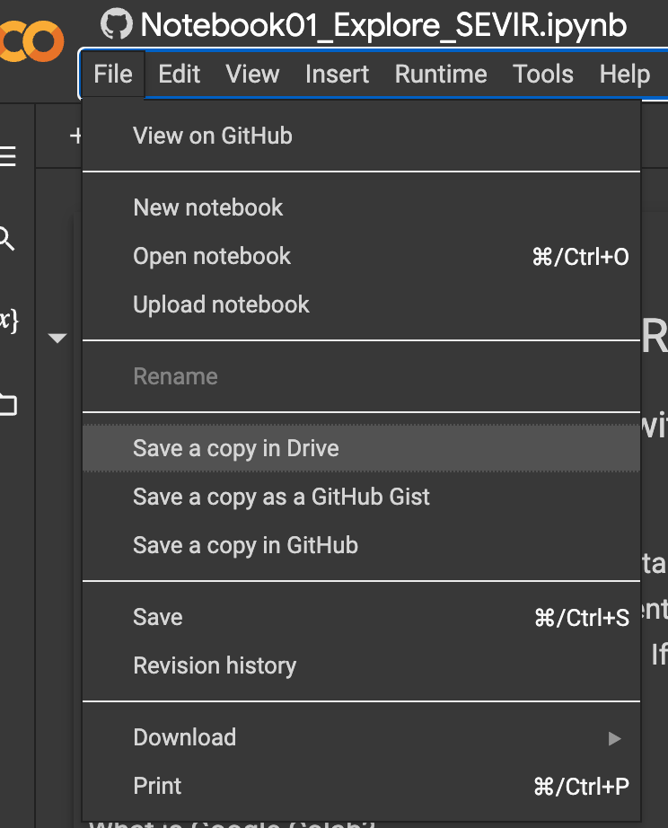

# WAF Tutorial Part 1: Traditional ML 

## Introduction 
This repository is the code associated with the [WAF](https://journals.ametsoc.org/view/journals/wefo/wefo-overview.xml) manuscript titled: "A Machine Learning Tutorial for Operational Meteorology, Part I: Traditional Machine Learning" written by Chase, R. J., Harrison, D. R., Burke, A., Lackmann, G. and McGovern, A. Find the paper [here](https://journals.ametsoc.org/view/journals/wefo/37/8/WAF-D-22-0070.1.xml) and provide any comments via email to the corresponding author. If you have any issues with the code (bugs or other questions) please leave an [issue](https://github.com/ai2es/WAF_ML_Tutorial_Part1/issues) associated with this repo.

This first paper and repo (of two) covers the *traditional* supervised machine learning methods (e.g., the ```sklearn``` models; if you don't know what that phrase even means thats OK! Check out Section 2 in the paper). We decided to start off with the orginal machine learning methods, before jumping into the more advanced techniques. Part two of this paper series digs into neural networks and deep learning. That paper is under review now, but can be read [here](https://arxiv.org/abs/2211.00147). The code for the part 2 paper can be found [here](https://github.com/ai2es/WAF_ML_Tutorial_Part2).

## Motivation

 

Meteorological journal articles mentioning or using machine learning is growing rapidly (see figure above or Figure 1 in the paper; Data are derived from Clarivate Web of Science). Since there is such rapid growth and formal instruction of machine learning topics catered for meteorologsts are scarce, this manuscript and code repository were created. The goal is to familiarize meteorologists with the tools of machine learning and accelerate the use of machine learning in meteorological workflows. In order to accomplish these goals, it is imperative that code and a sandbox for readers to play around with exisit. 

## Background on the example dataset

Beyond just discussing the machine learning topics in an abstract way, we decided to show an end-to-end example of the machine learning *pipeline* using the [The Storm EVent ImagRy (SEVIR) dataset](https://proceedings.neurips.cc/paper/2020/file/fa78a16157fed00d7a80515818432169-Paper.pdf)


SEVIR consists of over 10,000 matched storm events measured by satellite (i.e., GOES-16) and radar (i.e., NEXRAD) images. The specific variables are: red channel visible reflectance, mid-tropospheric water vapor channel brightness temperatures, clean infrared channel brightness temperatures, retrieved vertically integrated liquid and GOES Lightning Mapper (GLM) measured lightning flashes. The SEVIR dataset github repo can be found [here](https://github.com/MIT-AI-Accelerator/eie-sevir) and a helpful notebook tutorial can be found [here](https://nbviewer.jupyter.org/github/MIT-AI-Accelerator/eie-sevir/blob/master/examples/SEVIR_Tutorial.ipynb). We thank the authors (Mark S. Veillette, Siddharth Samsi and Christopher J. Mattioli) of SEVIR for their efforts and creating a high-quality, open source meteorological dataset primed for machine learning. This dataset will be the centerpiece for both this paper and the next paper in the series. 

# Getting Started

There are two main ways to interact with the code here. 

## Use Google Colab 

   This is the recommended and the quickest way to get started and only requires a (free) google account. Google Colab is a cloud instance of python that is run from your favorite web browser (although works best in Chrome). If you wish to use these notebooks, navigate to the directory named ```colab_notebooks```. 
   
   Once in that directory, select the notebook you would like to run. There will be a button that looks like this once it loads: 

   

   Click that button and it will take you to Google Colab where you can run the notebook. Please note it does not save things by default, so if you would like to save your own copy, you will need to go to File -> save a copy in drive

   


   Google colab is awesome for those who do not know how to install python, or just dont have the RAM/HDD locally to do things. You can think of it this way. This notebook is just providing the instructions (i.e., code) to do what you want it to. Meanwhile the data and physical computer are on some Google machine somewhere, which will execute the code in the notebook. By default this google owned machine will have 12 GB of RAM and about 100 GB of HDD (i.e. storage). 
   
## Install python on your local machine and run notebooks there

   This is a bit more intense, especially for people who have never installed python on their machine. This method does allow you to always have the right packages installed and would enable you to actually download all of the SEVIR dataset if you want it (although it is very big... 924G total). 

   1. Setup a Python installation on the machine you are using. I
   recommend installing [Miniconda](https://docs.conda.io/en/latest/miniconda.html) since
   it requires less storage than the full Anaconda Python distribution. Follow
   the instructions on the miniconda page to download and install Miniconda
   for your operating system. It is best to do these steps in a terminal (Mac/Linux) or powershell (Windows)

      Once you get it setup, it would be good to have python and jupyter in this base environment.

      ``` $ conda install -c conda-forge python jupyterlab ``` 

   2. Now that conda is installed, clone this repository to your local machine with the command:

      ``` $ git clone https://github.com/ai2es/WAF_ML_Tutorial_Part1.git ``` 

      If you dont have git, you can install git ([Install Git](https://git-scm.com/book/en/v2/Getting-Started-Installing-Git)) or choose the "Download Zip" option, unzip it and then continue with these steps. 

   3. Change into the newly downloaded directory 

      ``` $ cd WAF_ML_Tutroial_Part1.git ``` 

   4. It is good practice to always make a new env for each project you work on. So here we will make a new environment  

      ``` $ conda env create -f environment.yml ``` 

   5. Activate the new environment 

      ``` $ conda activate waf_tutorial_part1 ``` 

   6. Add this new environement to a kernel in jupyter 

      ```$ python -m ipykernel install --user --name waf_tutorial_part1 --display-name "waf_tutorial_part1" ```

   7. Go back to the base environment 

      ```$ conda deactivate ``` 

   8. Start jupyter

      ``` $ jupyter lab ``` 

   9. You should be able to open the notebooks with this repository and you should be able to add the kernel we just installed with the name *waf_tutorial_part1*. To change from the default kernel, click on the ```kernels``` tab and select ```Change Kernel...``` and select the ```waf_tutorial_part1``` kernel.  
