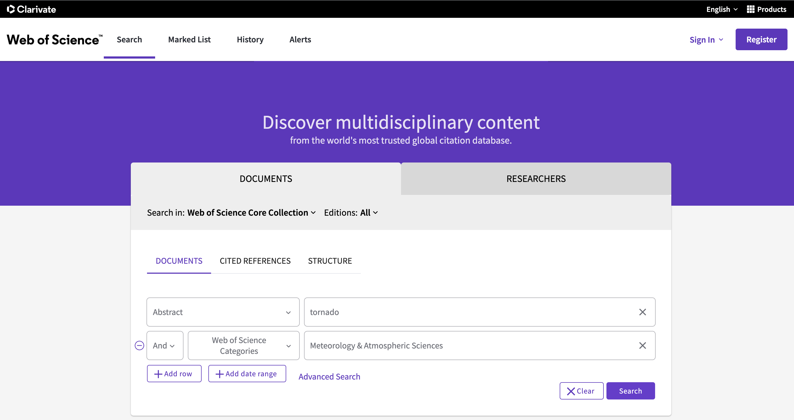

# What's in this folder?

This folder houses the data for making Figure 1 in the manuscript (the publication rate plot). All of this data is sourced from [Clarivate Web of Science](https://www.webofscience.com/wos/woscc/basic-search). If you are on a university campus (or are using a vpn), you should see something like the following when clicking the link: 

 

Warning, I made this in Spring of 2022, so if the interface has changed, I am unsure of how to reproduce these data. 

## How to get all Meteorology papers count: 
- Corresponding file: ```AllMeteorologyAtmospheric.txt```

This file contains the count of all papers published within the Web of Science category *Meteorology and Atmospheric Sciences*. To recreate this file first select the category: 


You should land on this page, now select *analyze results*


Change this box to *Publication Years*


Scroll to the bottom and download the datatable! 


## How to get query words in abstracts: 
- Corresponding files: ```AllAI.csv``` and ```AllSevere.csv```

From the home page, change this box to *Abstracts* 


Put in the keyword you wish to look for and a row and add in the *Meteorology and Atmospheric Science Category*



You'll land here and to get more than just pub count per year (i.e., titles of papers), then you need to select citation report.


From here youll select *Export Full Report*


If there are more than 1000 papers, you'll need to repeat this step since it will only let you do 1000 at a time.


All the individual word query files can be sound in the sub-directories, ```./individual_categories/```